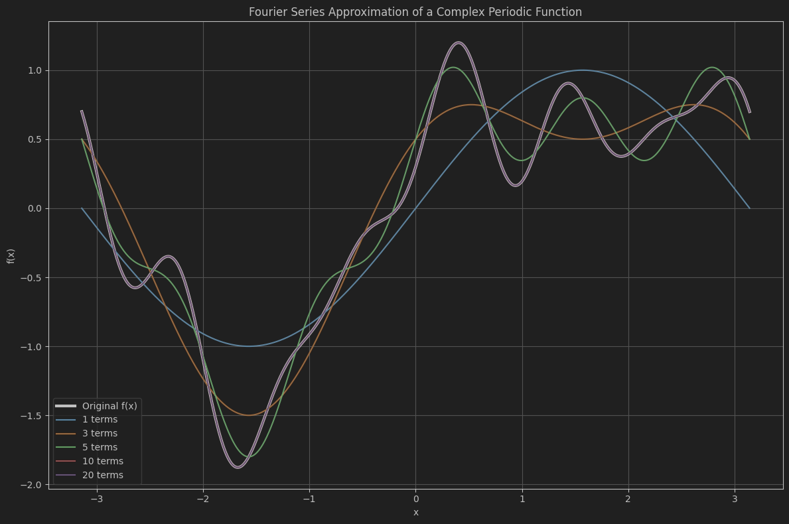

# **FourierVisualizer**

**FourierVisualizer** is a Python tool for numerically computing and visualizing Fourier series approximations of periodic functions.  
It showcases how the addition of sine and cosine harmonics reconstructs the original signal, with increasing approximation accuracy as more terms are used.

---

## 🔍 Project Overview

This project numerically computes the Fourier coefficients of a user-defined periodic function over the interval [-π, π] using the trapezoidal integration rule.  
It then reconstructs the function using a finite number of harmonics (sin and cos terms) and plots how the approximation improves as the number of terms increases.

The target function includes a mix of multiple sine and cosine waves of different frequencies to demonstrate complex harmonic behavior:

```python
f(x) = sin(x) + 0.5 * cos(2x) + 0.3 * sin(5x) - 0.2 * cos(7x)
````

---

## 📈 Key Features

* Numerical integration using `numpy.trapz` for Fourier coefficient estimation
* Modular code structure for computing `a₀`, `aₙ`, and `bₙ`
* Interactive visualization using `matplotlib`
* Adjustable number of harmonics for approximation: \[1, 3, 5, 10, 20]
* Clean and annotated plots comparing the original function to its Fourier approximations

---

## 🧮 How It Works

1. **Function Definition:** Define a custom periodic function `f(x)`
2. **Sampling:** Generate `x` values in the range \[-π, π] and compute `f(x)`
3. **Fourier Coefficients:**

   * $a_0 = \frac{1}{\pi} \int_{-\pi}^{\pi} f(x) dx$
   * $a_n = \frac{1}{\pi} \int_{-\pi}^{\pi} f(x) \cos(nx) dx$
   * $b_n = \frac{1}{\pi} \int_{-\pi}^{\pi} f(x) \sin(nx) dx$
4. **Approximation:** Construct the series:

   $$
   f_N(x) = \frac{a_0}{2} + \sum_{n=1}^{N} \left( a_n \cos(nx) + b_n \sin(nx) \right)
   $$
5. **Plotting:** Visualize the original function and each Fourier approximation
---
## 📊 Example Plot



---

## 🛠 Dependencies

* Python ≥ 3.7
* NumPy
* Matplotlib

Install requirements using:

```bash
pip install numpy matplotlib
```

---

## ▶️ How to Run

```bash
python fourier_visualizer.py
```

> The script will generate a plot comparing the original function to its Fourier approximations using different numbers of terms.

---

## 📌 Future Extensions

* Add support for user-defined functions via input or GUI
* Export Fourier coefficients to CSV or LaTeX
* Animate convergence of Fourier series
* Extend to 2D Fourier series (e.g., image processing)

---

## 🧠 Applications

* Signal processing and frequency analysis
* Education and visualization of Fourier theory
* Function approximation and compression
* Harmonic analysis of complex periodic phenomena

---

## © License

MIT License — feel free to use, modify, and distribute with attribution.

---

## 🤝 Contributions

Contributions, suggestions, and improvements are welcome! Please open an issue or submit a pull request.
